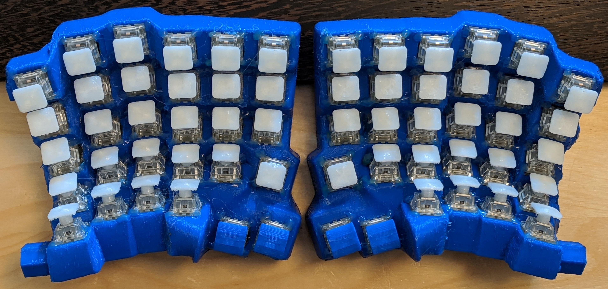
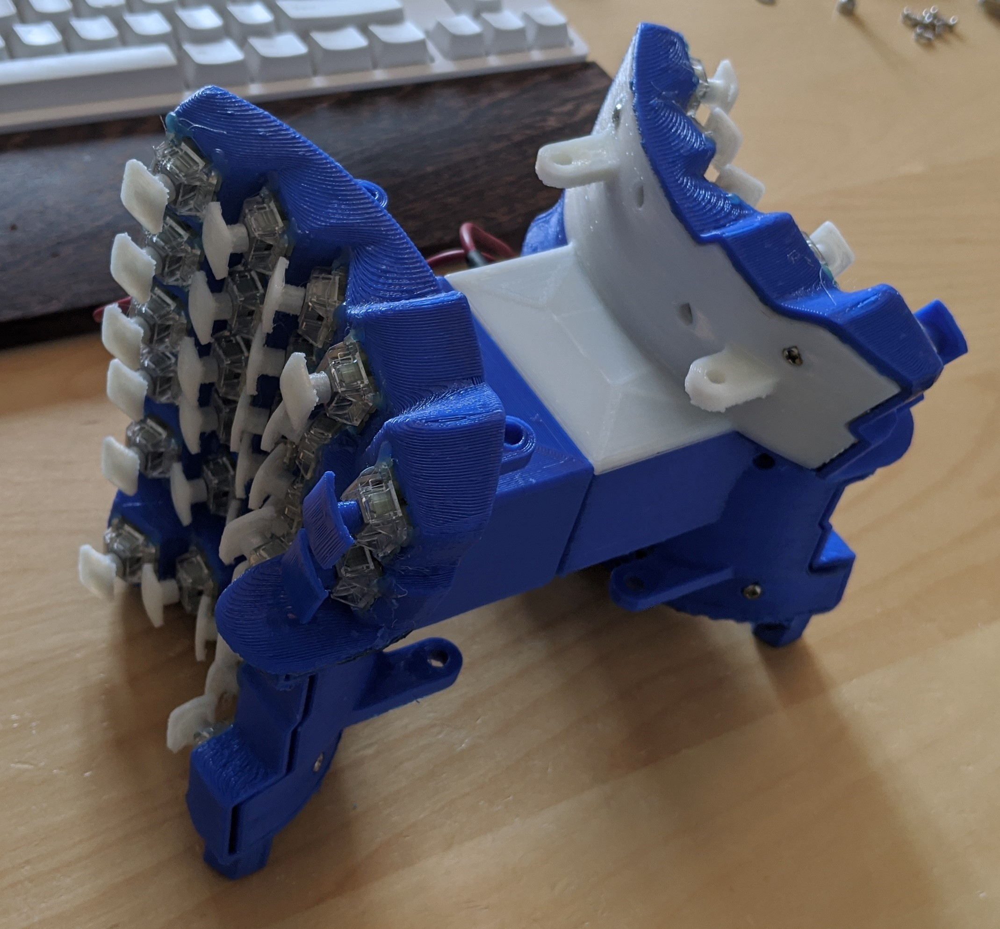
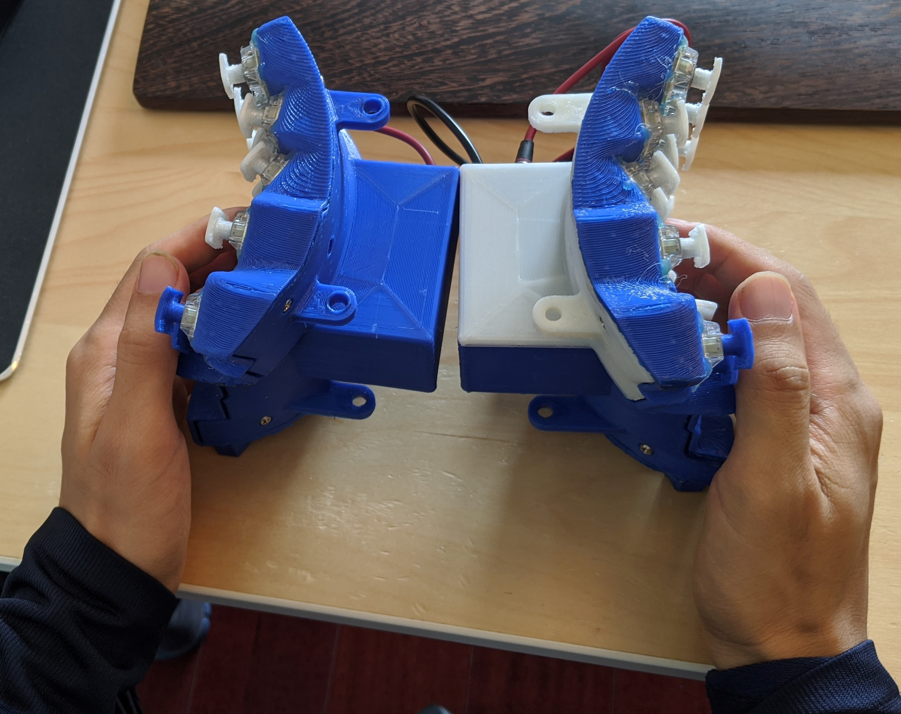

# Keyboard Case

## Folder Layout
"./GeneralAnthropometricData/" contains anthropometric data for the world's population.   
"./Images/MeasurementMethods/" constains photos illustrating how I took my own anthropometric data.  
"./STLFiles/" constains the .stl files for the EVK.

## Requirements
0. A 3D modelling software is required to design the case. I have tried many but only Siemens NX12 cut it. 
1. 16 M3x8 self-tap screws.  
2. 8 M5x16 screws and nuts.
3. 8mm diameter x 3mm deep silicon rubber sticking dome feets.

## Siemens NX Modelling 
I parametrically modelled the case after my own hand. The current size should fit others, as I am 1.7m tall, which is the world's average according to Google.
3D printing tolerances have been modelled into the parts. See "ToleranceAndClearance.prt".  

### Step 0. Find the Natural Path (spline) Travelled by the Middle Finger.
Other keyboards such as the Ergodox and Dactyl only model the path swept by our fingers with a circle. We can do better than that.  
Put a piece of paper on the table and rest the left hand on this piece of paper with its palm pointing straight to the right. Now use a pen to trace the path travelled by the middle finger.
<!--  -->

The middle finger is used because it's the longest one, making the curve more accurate. We assume that the other fingers will trace out the same shaped spline.  
Now, import the raster image into NX12 and sketch the spline.  
I did this in the file "ASM_MASTER_MidFingeColumn.prt".  

### Step 1. Find the tilt of each key along the spline to make key presses more enjoyabel.
How we direct our fingers to press the keys depends on how curled our fingers are.  
I had to experiment how it's best to oriente the keys along the spline empirically:    
  

### Step 2. Cheate the key assembly
Get the 3D model for the Cherry Key Switch from [GrabCAD](https://grabcad.com/library?page=1&time=all_time&sort=recent&query=cherry%20switch).  
Create the keycaps and assemble them onto the Cherry Key model in "ASM_Key.prt":  
 
 
### Step 3. Mount the keys to the midfinger's path of travel
Now go back to "ASM_MASTER_MidFingeColumn.prt" and mount the key assembly:  
   

In this step, I also connected the mounts with NX features "Bridge Curve", "Studio Surface", and "Sew".  This saves unneeded work down the road.  

### Step 4. Create family parts for the other fingers 
Change the length of finger to proportionally create the same assembly for the other fingers.
   
See "ASM_SLAVE_LittleFingerColumn.prt"  
The thumb assembly has to be created separately. See "ASM_ThumbPlate.prt".  
 
### Step 5. Assemble and position all the finger files together
See "ASM_Case_LeftHand.prt":  
  
Use "Change Reference Part" in NX to display the mounts:  
  

### Step 6. Make the case
See "ASM_Case_LeftHand.prt":   
  

## 3D Printing the Case
My 3D printer parameters are documented [here] (https://github.com/YangPiCui/3DPrinterCalibrationAndTuning/tree/master/DoogellVegaWithPLA).  
Make sure to update "ToleranceAndClearance.prt" for your own print parameters.  
"./NX_ErgonomicVerticalKeyboard/STL Files" constains Cura project files.  
I have modelled the case to be printed vertically and added tear-drop shaped M3 self-tapping pilot holes to do away with some supports:  
 

Back of the left front case:  
  

Both front cases with press-fit keycaps and hot-glued switches:  
 

Front and back cases without connector rods and hand rests. I ran out of blue filaments, so I printed half of the right backplate with white filaments and glued it onto the existing part.  
 
 
 

