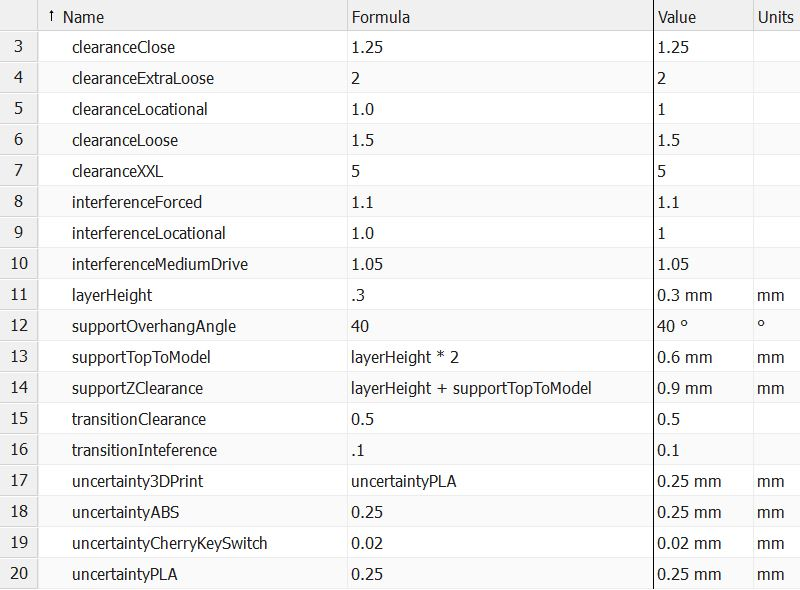
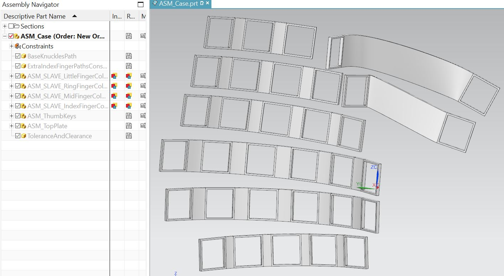
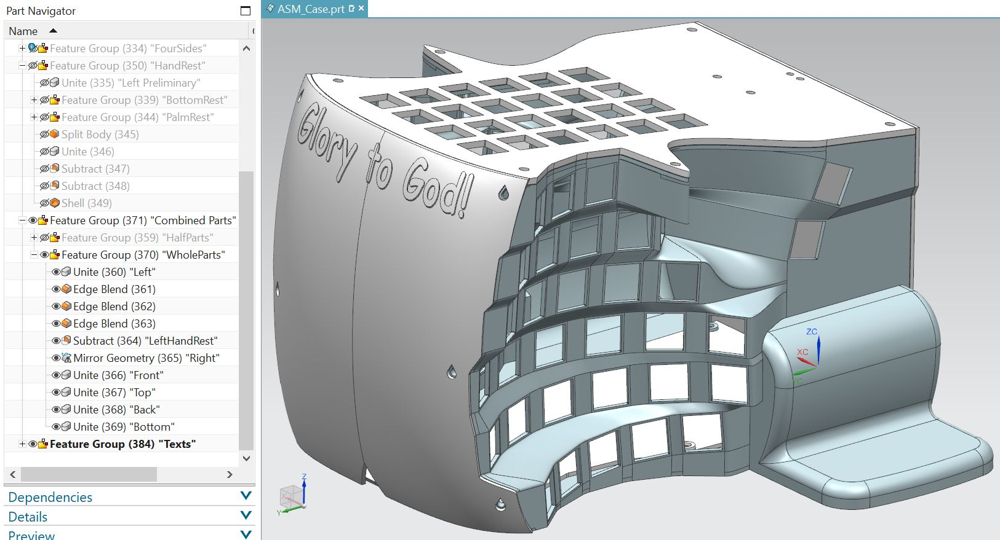
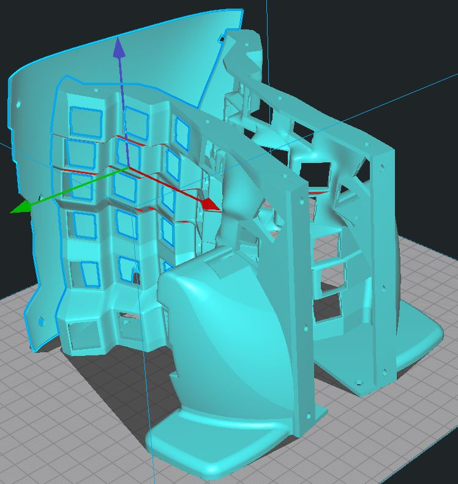
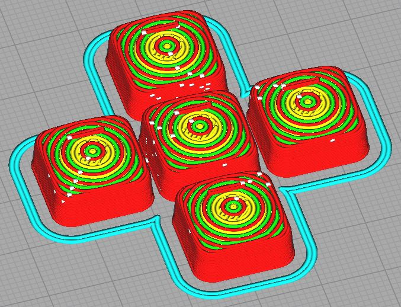

# Case Design 
I have previously outlined the [design process](https://github.com/YangPiCui/ErgonomicVerticalKeyboard/tree/master/EVKVersions/EVK_v0.0/Case#siemens-nx-modelling) with Siemens NX in EVK v0.0. Since then, I have found that
* A circular keywell works better. Our hands, not just our fingers, should also move while typing.
* A thumbrest is unnecessary. A free thumb is a more comfortable thumb.  
Below summary is based on EVK v0.1.2  

### Set the Tolerances

### Design the Keycaps

### Oriente the Keys for the Middle Finger
ASM_MASTER_MidFingerColumn.prt  
  

### Position the KeyMounts
Use the Family Part feature to generate keys for the other long fingers.   
Oriente the thumb keys with respect to the middle finger.  
  

### Connect the KeyMounts
  

### Draw the Walls
 

### Add HandRest and Sponsor Message
 

# 3D Print
"./3DPrintFiles/"  
"./CuraSlicerSettings/" 
The parts are of high precision. The fits are transitional clearance. [Calibrate](https://github.com/YangPiCui/3DPrinterCalibrationAndTuning/) your 3D printer accurately and follow the instructions closely. 

### Left and Right
* Nozzle Diameter 0.3mm
* Layer Height 0.24mm
* Line Width 0.54mm
* Tree Support Top Distance is 0.48mm, or twice the layer height. IMPORTANT. Do NOT set this value greater than what I have specified, otherwise the keyswitch might not fit. 
* Support Line Width 0.24mm for easy support removal   
Print the Left Right and Front as if they would normally stand on the build plate. Set brim distance to 0mm for Front but not for Left or Right.  
  
  
  
### Top Bottom and Back
If switches do not fit on the Top Plate. Try adjusting the Horizontal Expansion in Cura. 
  
### 0. Keycaps
The keycaps are a press-fit onto the Cherry Switches!  
* Layer Height = 0.16mm 
* Support still needed in this version. No support necessary after v0.1.1. 
* Brim & Support Brim = off; They are painful to remove. 
Print the keycaps as if they would sit on the build plate. 
KeycapHome x 12 (8 for the home row and 4 for the most bottom row)  
KeycapThumb x 4  
KeycapNormal x 74  
   

  

## 1. Assembly
### 0. Hot-glue Cherry Key Switches
I put some hot glue on the four corners of each keyswitch to secure it on the plates. 
  
### 1. Press-fit Keycaps
First use a soldering iron and a knife to smooth and trim the edges of the printed keycaps. Then press-fit the keycaps onto the keyswitches.

###### [ODC Open Database License v1.0](https://choosealicense.com/appendix/)  (free but no patent or commercial use)