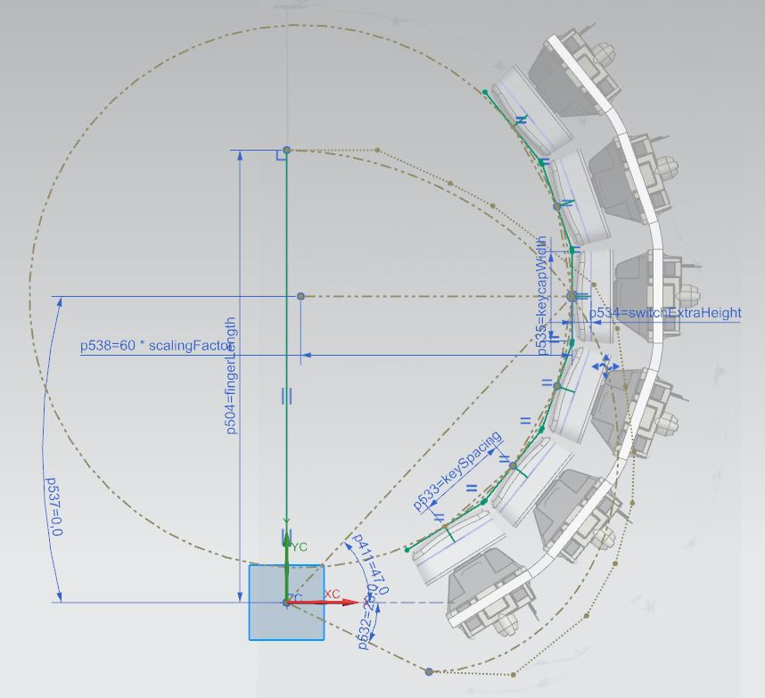

# Case Design 
I have previously outlined the [design process](https://github.com/YangPiCui/ErgonomicVerticalKeyboard/tree/master/EVKVersions/EVK_v0.0/Case#siemens-nx-modelling) with Siemens NX in EVK v0.0. Since then, I have found that
* A circular keywell works better. Our hands, not just our fingers, should move during typing.
* A thumbrest is unnecessary. A free thumb is a more comfortable thumb.
Below summary based on the EVK v0.1.2

## Case Design - 0.Oriente the Keys for the Middle Finger
ASM_MASTER_MidFingerColumn.prt  

# 3D Printing the Components
"./3DPrinterFiles/" constains the .stl files of the various parts. Modelling uncertainty for part clearance = +/-0.25mm (tolerance 0.5mm)  
Before 3D printing the parts, make sure to fully calibrate your printer. [This is what I did.](https://github.com/YangPiCui/3DPrinterCalibrationAndTuning/)  
"./CuraSlicerSettings/" contains my Cura print settings  
  
### 0. Keycaps
Print the keycaps in this orientation for a smooth finish:  
  
Layer Height = 0.16mm  
Brim & Support Brim = off (turn brims off so that they don't stick to the keycaps)  
See Cura settings in "./CuraSettings/Vega PLA ND=0.3 LH=0.16.curaprofile"   
I have designed the keycaps for a press-fit on the Cherry Switches, but you may have to calibrate your own printer to achieve this result.  

KeycapHome x 12 (8 for the home row and 4 for the most bottom row)  
KeycapThumb x 4  
KeycapNormal x 74  
  

### 1. Other parts
There will be much support structure. Be patient in removing it.  
Print these parts in this orientation to minimize support:
  
Layer Height = 0.24mm (See the settings in "./CuraSettings/Vega PLA ND=0.3 LH=0.24.curaprofile")  
  
LeftHandPlate x 1  
RightHandPlate x 1 (just mirror the LeftHandPlate.stl in Cura)  
TopWall x 1  
... x 1  

## 1. Assembly
### 0. Hot-glue Cherry Key Switches
I put some hot glue on the four corners of each keyswitch to secure it on the plates. 
  
### 1. Press-fit Keycaps
First use a soldering iron and a knife to smooth and trim the edges of the printed keycaps. Then press-fit the keycaps onto the keyswitches.

###### [ODC Open Database License v1.0](https://choosealicense.com/appendix/)  (free but no patent or commercial use)