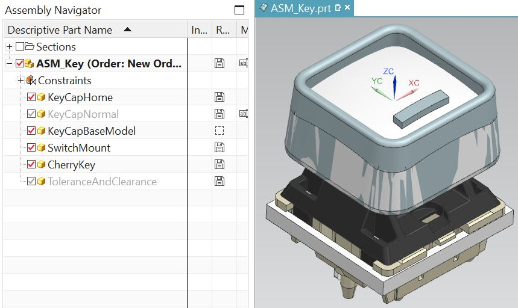
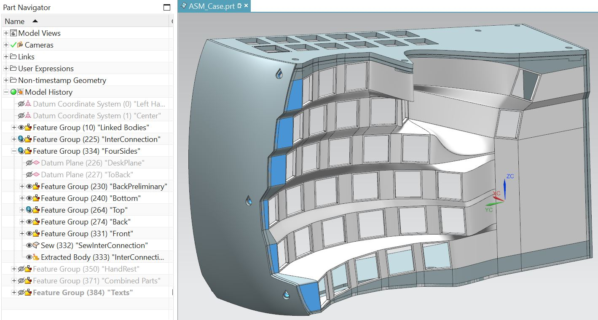

# Case Design 
I have previously outlined the [design process](https://github.com/YangPiCui/ErgonomicVerticalKeyboard/tree/master/EVKVersions/EVK_v0.0/Case#siemens-nx-modelling) with Siemens NX in EVK v0.0. Since then, I have found that
* A circular keywell works better. Our hands, not just our fingers, should also move while typing.
* A thumbrest is unnecessary. A free thumb is a more comfortable thumb.  
Below summary is based on EVK v0.1.2  

### Set the Tolerances

### Design the Keycaps

### Oriente the Keys for the Middle Finger
ASM_MASTER_MidFingerColumn.prt  
  

### Position the KeyMounts
Use the Family Part feature to generate keys for the other long fingers.   
Oriente the thumb keys with respect to the middle finger.  
  

### Connect the KeyMounts
  

### Draw the Walls
 

### Add HandRest and Sponsor Message
 

###### [ODC Open Database License v1.0](https://choosealicense.com/appendix/)  (free but no patent or commercial use)