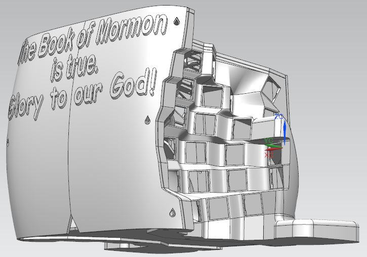

# 0. Part List  
* 1x Teensy 2.0 USB Board. （开发板）  
* 90 Cherry Mechanical Switch. （樱桃轴）
* 90 1N4148 diode.（开关二极管）One diode for each key switch.
* 2x 3mm T1 LEDs. （发光二极管）  
* 2x 1kΩ resistors to connect in series with the LEDs.（电阻） 
* 0.6mm (wire diameter) tin-coated naked wire.
* 20cm long, 0.6mm (core diameter) sillicon wrapped wire. Get these pre-soldered ones to save time.
* 24 M3x6mm flat tip self-tap screws.
* 10 8mm diameter x 3mm tall silicon dome sticker feet.
* Hotglue and hotglue gun.

# [1. Case](Case) 

# [2. Keymap](Keymap) 

# [3. Electronics, Firmware and Software](ElectronicsFirmwareAndSoftware)

###### [ODC Open Database License v1.0](https://choosealicense.com/appendix/)  (free but no patent or commercial use)
