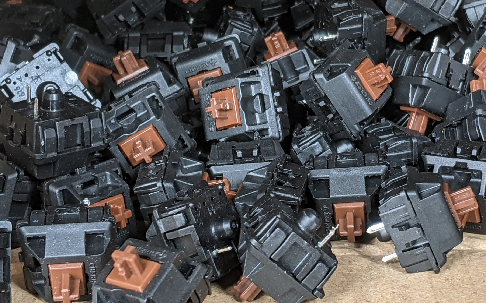
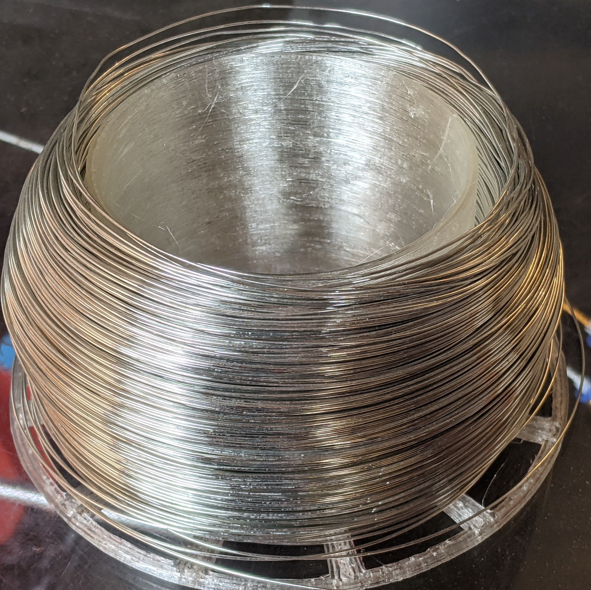
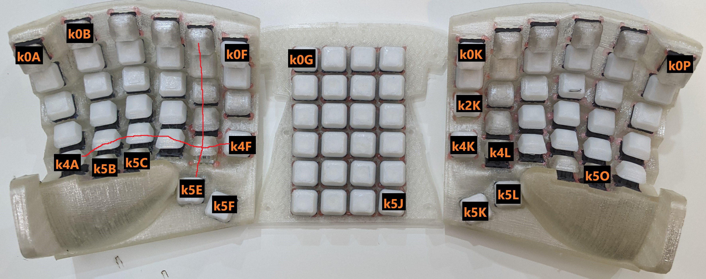

# 0. Part List  
* 1x Teensy 2.0 USB Board. （开发板）  

* 90 Cherry Mechanical Switch. （樱桃轴）

* 90 1N4148 diode.（开关二极管）One diode for each key switch.
* 2x 3mm T1 LEDs. （发光二极管）  
* 2x 1kΩ resistors to connect in series with the LEDs.（电阻）

* 0.6mm (wire diameter) tin-coated naked wire.

* 20cm long, 0.6mm (core diameter) sillicon wrapped wire. Get these pre-soldered ones to save time.

* 24 M3x6mm flat tip self-tap screws.

* 10 8mm diameter x 3mm tall silicon dome sticker feet.

* Soldering Iron and Hot Glue Gun.

# [1. Case Design](CaseDesign) 

# 2. Keymap 
I manually designed a keymap based on English [letter](https://norvig.com/mayzner.html) and [character](http://xahlee.info/comp/computer_language_char_distribution.html) frequencies.  
[Access this keymap on the Keyboard Layout Editor](http://www.keyboard-layout-editor.com/#/gists/2fc38dca845ec5f253bac7c052df82da)  
  
[It fares OK against other traidtional layouts according to the Keyboard Layout Analyzer.](http://patorjk.com/keyboard-layout-analyzer/#/load/hqrGn4NG)

# [3. Electronics, Firmware and Software](ElectronicsFirmwareAndSoftware)

# 4. 3D Print 
"./3DPrintFiles/"  
"./CuraSlicerSettings/" 
The parts are of high precision. The fits are transitional clearance. [Calibrate](https://github.com/YangPiCui/3DPrinterCalibrationAndTuning/) your 3D printer accurately and follow the instructions closely. 

### Left Right and Front  
* Nozzle Diameter 0.3mm
* Layer Height 0.24mm
* Line Width 0.54mm
* Tree Support Top Distance is 0.48mm, or twice the layer height. IMPORTANT. Do NOT set this value greater than what I have specified, otherwise the keyswitch might not fit. 
* Support Line Width 0.24mm for easy support removal   
Print the Left Right and Front as if they would normally stand on the build plate. Set brim distance to 0mm for Front but not for Left or Right.  
  
  
  
### Top Bottom and Back
If switches do not fit on the Top Plate. Try adjusting the Horizontal Expansion in Cura. 
  
### Keycaps
The keycaps are a press-fit onto the Cherry Switches!  
* Layer Height = 0.16mm 
* Support still needed in this version. No support necessary after v0.1.1. 
* Brim & Support Brim = off; They are painful to remove.  
Print the keycaps as if they would sit on the build plate.  
KeycapHome x 12 (8 for the home row and 4 for the most bottom row)   
KeycapThumb x 4   
KeycapNormal x 74   
    
Use a knife to trim the excess edges of the printed keycaps.
  
  
## 5. Assembly

### Hot-glue Cherry Key Switches
Put some hot glue on the four corners of each keyswitch to secure it on the plates. Do it on the inside for a nicer finish on the outside.  
  

### Wire up the Keyboard Matrix  
Rows and columns on the physical keyboard:  
  
Note #define DIODE_DIRECTION ROW2COL in config.h -- current flows from the positive Teensy pins into the matrix rows and out of the columns to the ground pin.  

### 0. Rows  
I used a naked wire to connect the switches on each row together. 
 

### 1. Columns
First solder the diodes. The diodes need the black bar facing away from the key. The diode's black bar indicates its negative terminal.  
  
  
Wire up the columns. One can use hot glue for insulation against naked wires.   
  
  
Connect the rows.  
  

### Wire up the Micro Controller
See [Section 1.2.1](https://github.com/YangPiCui/ErgonomicVerticalKeyboard/tree/master/EVK_v1.3/ElectronicsFirmwareAndSoftware#121-handwiredevkv1_3) for which Teensy pins corresponds to the rows and columns and LEDs.  
Note that pin D5 on the Teensy is used for the layer switch indicator LED.  
  
  
LEDsAndResetButton  
  

### Put on the Sillicon Rubber Feet  
  

### Smile

###### [ODC Open Database License v1.0](https://choosealicense.com/appendix/)  (free but no patent or commercial use)
