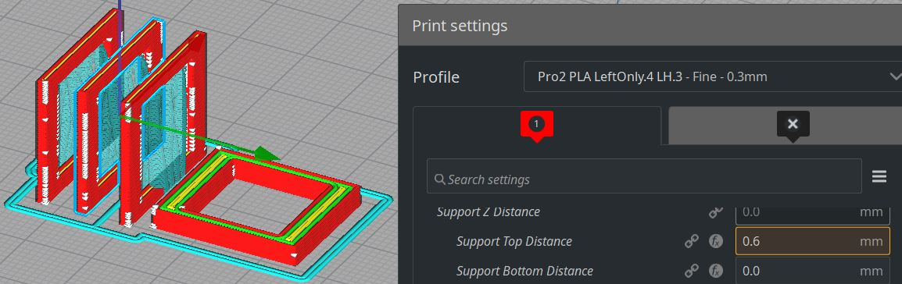

  
  
 
   
  
Please refer to the same sections in EVK_v0.1.1  
  
Test print SwitchMountLeftRight.3mf and SwitchMountTop.3mf to check switch fit.  

###### [ODC Open Database License v1.0](https://choosealicense.com/appendix/)  (free but no patent or commercial use)
