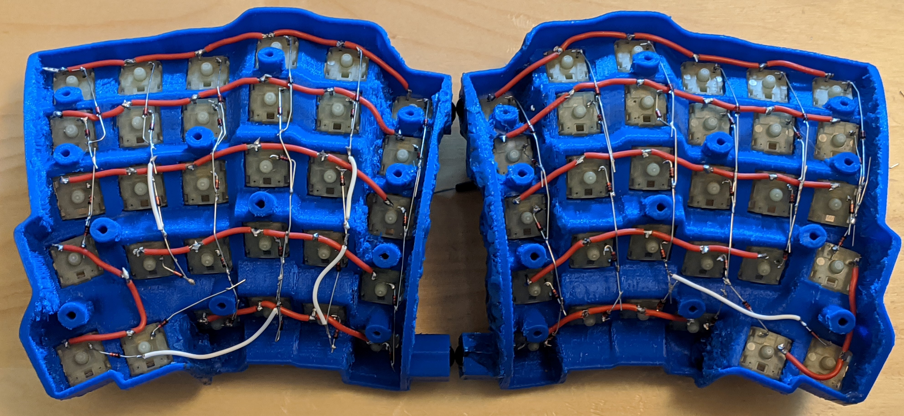

# ElectronicsFirmwareAndSoftware

## 0. Shop Parts  
1. 94x Cherry Mechanical Switch （樱桃银轴）  
2. [1x Teensy 2.0 USB Board （开发板）](https://item.taobao.com/item.htm?spm=a1z09.2.0.0.7d1f2e8depIv8w&id=537590679522&_u=b1t8kl8uaf14)  
3. Teensy header pins <- [单排针1*40双排排针2*40圆2.54mm间距](https://detail.tmall.com/item.htm?id=13700799942&spm=a1z09.2.0.0.7d1f2e8depIv8w&_u=b1t8kl8ud5aa)  
4. [100x 1N4148 （开关二极管）](https://detail.tmall.com/item.htm?id=15641176828&spm=a1z09.2.0.0.7d1f2e8depIv8w&_u=b1t8kl8u798e)  
5. 2x 2.2kΩ resistors (red, red, red) （电阻 ）  
6. 3x 3mm T1 LEDs （发光二极管）  
7. 3x 220 Ω resistors, or match to LED. (red, red, brown) （电阻）  
8. 30AWG sillicon wire （0.5mm 硅胶线）  

## 1. Design Custom QMK Firmware for the EVK
### 1.0 [Setup the QMK build environment](https://docs.qmk.fm/#/newbs_getting_started)  
During Windows setup, follow [this](https://stackoverflow.com/questions/41932407/which-python-should-i-install-and-how-when-using-msys2) and [this](https://stackoverflow.com/questions/48087004/installing-pip-on-msys) to install Python3 and pip on MSYS2.

### 1.1 Fork https://github.com/qmk/qmk_firmware on Github
[Keep the forked repository and the local copy up-to-date](https://www.earthdatascience.org/courses/intro-to-earth-data-science/git-github/github-collaboration/update-github-repositories-with-changes-by-others/)  
Local QMK Repository Path: C:\Users\<UserName>\qmk_firmware  

### 1.2 Write Custom Codes
[Understanding QMK’s Code](https://docs.qmk.fm/#/understanding_qmk?id=matrix-to-physical-layout-map)  
Copy /keyboards/handwired/dactyl_left into /keyboards/handwired/evk and [modify the files](https://docs.qmk.fm/#/hardware_keyboard_guidelines?id=custom-keyboard-programming) in /handwired/evk/1_3/:   
* readme.md - no change  
* info.json - no change  
* rules.mk - no change  
* 1_3.c - no change  
* config.h  
  * change matrix size from 6x6 to 6(rows) x 16(cols)  
  * define the matrix row and col pins for [Teensy 2.0](https://www.pjrc.com/teensy/pinout.html)  
* 1_3_h    
  * [define the matrix to physical layout map](https://docs.qmk.fm/#/reference_configurator_support). ([the keymap variables can be whatever as long as they are unique](https://www.reddit.com/r/olkb/comments/42ohxz/crazy_columns_and_tons_of_keys_with_qmk/?utm_source=amp&utm_medium=&utm_content=post_body))

### 1.3 Build the JSON file


## 1. Wiring up the Keyboard Matrix
Understand the keyboard matrix ([reference](https://www.dribin.org/dave/keyboard/one_html/) | [reference](https://deskthority.net/wiki/Rollover,_blocking_and_ghosting))  
Wiring of the key switches depends on the firmware and keymap setup.  
The QMK matrix code for the EVK v1.3:  

```c
// matrix positions
{   // MCP23018
 { k00, k10, k20,   k30, k40,   KC_NO },                     \
 { k01, k11, k21,   k31, k41,   k51   },                     \
 { k02, k12, k22,   k32, k42,   k52   },                     \
 { k03, k13, k23,   k33, k43,   k53   },                     \
 { k04, k14, k24,   k34, k44,   k54   },                     \
 { k05, k15, k25,   k35, KC_NO, k55   },                     \
 { k06, k16, KC_NO, k36, KC_NO, k56   },                     \
    // Teensy
 { k07, k17, KC_NO, k37, KC_NO, k57   },                     \
 { k08, k18, k28,   k38, KC_NO, k58   },                     \
 { k09, k19, k29,   k39, k49,   k59   },                     \
 { k0A, k1A, k2A,   k3A, k4A,   k5A   },                     \
 { k0B, k1B, k2B,   k3B, k4B,   k5B   },                     \
 { k0C, k1C, k2C,   k3C, k4C,   k5C   },                     \
 { k0D, k1D, k2D,   k3D, k4D,   KC_NO }                      \
}
``` 

It looks like this physically:  
 

### Rows
You don't have to decide how to connect the rows to the Teensy or MCP yet. Just worry about getting the matrix right.  
Row 5 is the thumb cluster, so just wire them together and imagine they're in a row instead of it being more like a circle.  
For the right hand part:  
 

### Columns
The diodes need the black bar facing away from the key.  
For the right hand part:  
 

Both parts:  
 


## 2. Wiring up the electronics
  
 
 


## 3. QMK Firmware & Custom Keymap 


### QMK
Use the [QMK Corfigurator](https://docs.qmk.fm/#/newbs_building_firmware_configurator) to load the Ergodox_EZ keymap, modify it and generate the .hex file:  


### Flashing
Use the [Teensy Loader App](https://www.pjrc.com/teensy/loader.html) to flash the generated .hex file onto the Teensy 2.0 micro controller.  

###### [ODC Open Database License v1.0](https://choosealicense.com/appendix/)  (free but no patent or commercial use)