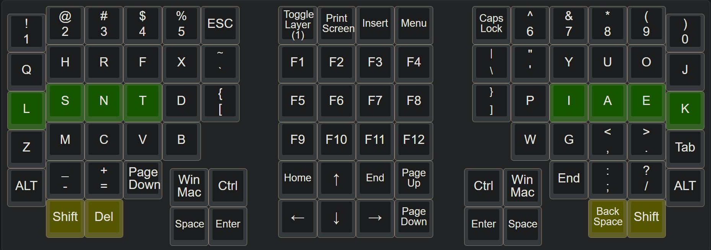

  
Please refer to the same sections in EVK_v1.3.
# 0. Part List  
Same parts used as for EVK_v1.3.

# 1. Case  
Updated files are in 3DPrinterFiles and CuraSlicerSettings folders.    

# 2. Keymap 
[Access the updated keymap on the Keyboard Layout Editor](http://www.keyboard-layout-editor.com/#/gists/2fc38dca845ec5f253bac7c052df82da) 

# 3. Electronics, Firmware and Software 
The wiring is almost identical to that of the EVK_v1.3.  
Modify EVK_v1.3's default keymap on the QMK Configurator and generate the .hex file.  
Updated .hex file is included.  

###### [ODC Open Database License v1.0](https://choosealicense.com/appendix/)  (free but no patent or commercial use)
