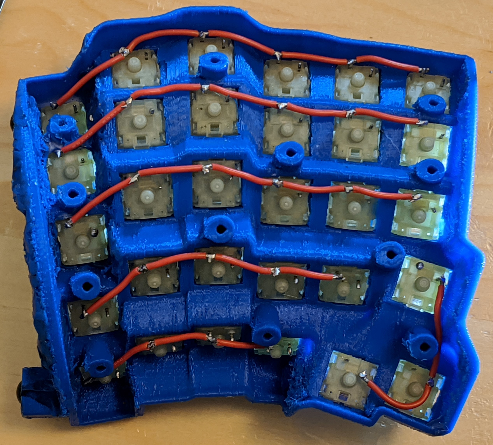

# Follow [This] (https://github.com/adereth/dactyl-keyboard/tree/master/qmk-guide) Guide (with content credits)  
URL: https://github.com/adereth/dactyl-keyboard/tree/master/qmk-guide
This guide is based on EVK version 1.2.

## Part List 
From https://www.ergodox.io/  
1. 56x Cherry Mechanical Switch <- 樱桃银轴
2. [1x Teensy 2.0 USB Board <- 开发板](https://item.taobao.com/item.htm?spm=a1z09.2.0.0.7d1f2e8depIv8w&id=537590679522&_u=b1t8kl8uaf14)
3. [1x MCP23018-E/SP I/O expander](https://item.taobao.com/item.htm?spm=a1z09.2.0.0.7d1f2e8depIv8w&id=590535614070&_u=b1t8kl8u64f3)  
4. 28 Pin IC Socket <- [1x SOP28/SSOP28/TSSOP28贴片转直插](https://detail.tmall.com/item.htm?id=13259612993&spm=a1z09.2.0.0.7d1f2e8depIv8w&_u=b1t8kl8ud655) for MCP23018-E/SO
5. Teensy header pins <- [单排针1*40双排排针2*40圆2.54mm间距](https://detail.tmall.com/item.htm?id=13700799942&spm=a1z09.2.0.0.7d1f2e8depIv8w&_u=b1t8kl8ud5aa)  
6. [100x 1N4148 <- 开关二极管](https://detail.tmall.com/item.htm?id=15641176828&spm=a1z09.2.0.0.7d1f2e8depIv8w&_u=b1t8kl8u798e)  
7. 2x 2.2kΩ resistors (red, red, red) <- 电阻  
8. 3x 3mm T1 LEDs <- 发光二极管  
9. 3x 220 Ω resistors, or match to LED. (red, red, brown) <- 电阻  
10. 1x 0.1 µF ceramic capacitor (marked “104” for 10*104 picofarad) <- 电容  
11. 2x TRRS Jacks <- [2x TRRS 3.5mm音频座](https://detail.tmall.com/item.htm?id=601564458381&spm=a1z09.2.0.0.7d1f2e8depIv8w&_u=b1t8kl8uc061)  
12. 1x TRRS Cable <- 4节3.5mm公对公音频线(>0.5m)  
13. 30AWG wrapping wire <- 0.5mm 直焊型漆包线免刮漆

## Wiring up the Matrix

Wiring of the key switches depends on the firmware and keymap setup. Here's what the matrix code for the Ergodox-EZ in QMK firmware looks like:  

```c
// matrix positions
{   // MCP23018
 { k00, k10, k20,   k30, k40,   KC_NO },                     \
 { k01, k11, k21,   k31, k41,   k51   },                     \
 { k02, k12, k22,   k32, k42,   k52   },                     \
 { k03, k13, k23,   k33, k43,   k53   },                     \
 { k04, k14, k24,   k34, k44,   k54   },                     \
 { k05, k15, k25,   k35, KC_NO, k55   },                     \
 { k06, k16, KC_NO, k36, KC_NO, k56   },                     \
    // Teensy
 { k07, k17, KC_NO, k37, KC_NO, k57   },                     \
 { k08, k18, k28,   k38, KC_NO, k58   },                     \
 { k09, k19, k29,   k39, k49,   k59   },                     \
 { k0A, k1A, k2A,   k3A, k4A,   k5A   },                     \
 { k0B, k1B, k2B,   k3B, k4B,   k5B   },                     \
 { k0C, k1C, k2C,   k3C, k4C,   k5C   },                     \
 { k0D, k1D, k2D,   k3D, k4D,   KC_NO }                      \
}
```
Physically, it looks like this for the Dactyl Keyboard:  
 

For EVK v1.2, it looks like this:
 

### Rows
You don't have to decide how to connect the rows to the Teensy or MCP yet. Just worry about getting the matrix right.  
Row 5 is the thumb cluster, so just wire them together and imagine they're in a row instead of it being more like a circle.  
For the right hand part:  
 

### Columns
The diodes need the black bar facing away from the key.  
For the right hand part:  
 

Both parts:  
 

## Keymap
Use this manually optimized keymap.


## Setup QMK Firmware
Note: while preparing the build environment for QMK, Follow [this](https://stackoverflow.com/questions/41932407/which-python-should-i-install-and-how-when-using-msys2) and [this](https://stackoverflow.com/questions/48087004/installing-pip-on-msys) to install Python3 and pip on MSYS2.

The ErgoDox uses the Teensy 2.0 and MCP23018  
Start with the Ergodox_EZ firmware.  


## This Keyboard is made possible thanks to these online resources
Understand the keyboard matrix ([reference](https://www.dribin.org/dave/keyboard/one_html/) | [reference](https://deskthority.net/wiki/Rollover,_blocking_and_ghosting))  
[Ergodox](https://www.ergodox.io/)  
[Dactyl Keyboard Wiring](https://github.com/adereth/dactyl-keyboard/blob/master/guide/README.org#wiring)   
[Ergo-Dox keyboard assembly](https://www.youtube.com/watch?v=x1irVrAl3Ts)  
[Keyboard PCB Guide](https://github.com/ruiqimao/keyboard-pcb-guide)   
[GMK Carbon Original Ergodox build log](https://imgur.com/a/3riAB)  
[Dactyl Manuform Mini DIY Ergonomic Mechanical Keyboard Build Log](https://www.beekeeb.com/dactyl-manuform-mini-mechanical-keyboard-build-log/)   
[Detailed guide to making a custom keyboard](https://www.reddit.com/r/MechanicalKeyboards/comments/4l0p41/guide_detailed_guide_to_making_a_custom_keyboard/?utm_source=amp&utm_medium=&utm_content=post_body)  
[Building your own keyboard (from scratch)](https://medium.com/@monkeytypewritr/building-your-own-keyboard-from-scratch-bd0638c40850)  

[Windows 10 Key Mapping software](https://thegeekpage.com/top-10-best-free-key-mapping-software-for-windows-10/)&nbsp;| [SharpKeys](https://github.com/randyrants/sharpkeys/releases)


 