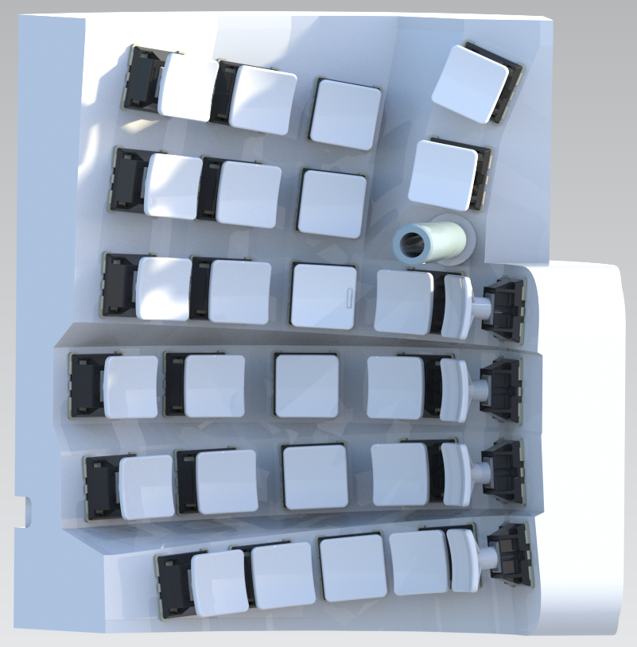

# Keyboard Case
The keyboard case will organize the key caps into a vertical [[SafeType](https://safetype.com/index.php?id_product=1&controller=product) | [ergodox ez vertical stand](https://www.thingiverse.com/thing:2748084)&nbsp;| [Ergodox EZ tent kit](https://www.thingiverse.com/thing:1433117) | [A Similiar Idea](https://thomasbaart.nl/2019/01/20/vertikeeb-making-a-vertical-keyboard-part-1/)] and concave [[Kinesis Advantage 2](https://kinesis-ergo.com/shop/advantage2/)  | [British patent 1,016,993](https://geekhack.org/index.php?topic=63415)] formation.  
Shift some of the extra columns from the little fingers to the index fingers. This alleviates the little fingers and it allows the hands to rest on the desk.  
Overload the keys to reduce the total number of keys. This saves costs, most of which comes from the mechanical key switches, and it simplifies the design.  
I have used my hands (I'm 1.7m tall) to parametrically design the case in Siemens NX. You only need to enter the length of your middle finger to scale the entire model in NX.

 

## Siemens NX Modelling

### 1. Positioning of the Keys
Find the natural path of the middle (longest) finger.  

