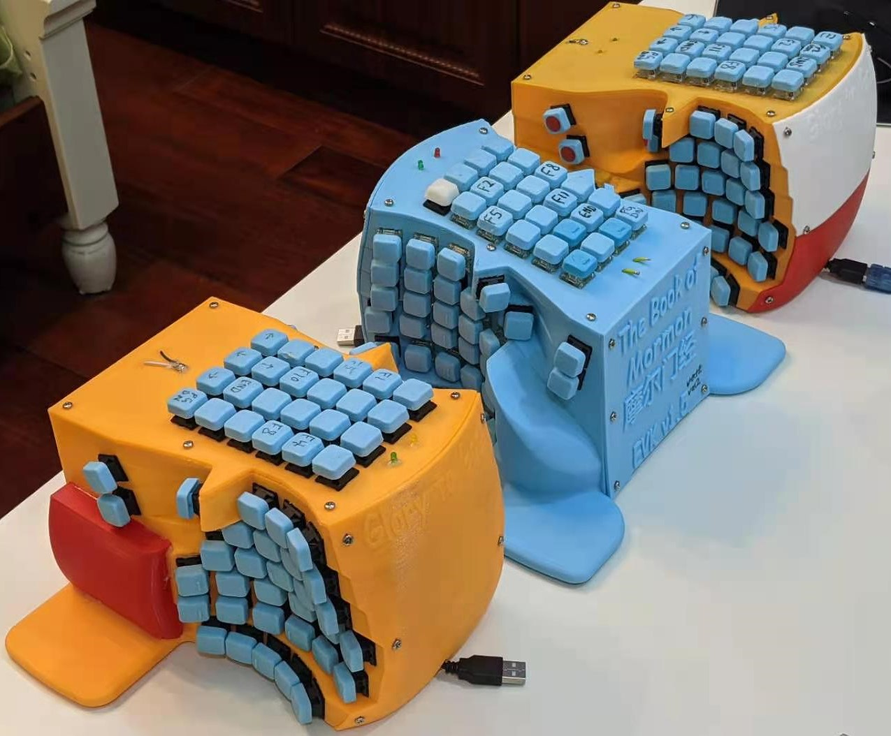
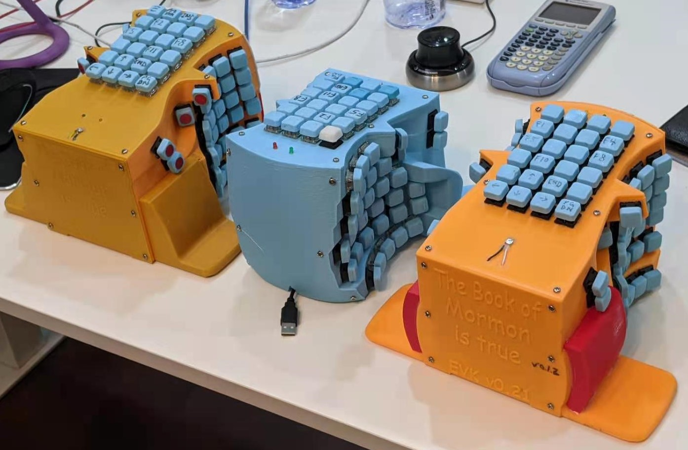

# Ergonomic Computer Keyboard (ECK)

## (switching to FreeCAD and slowly working on the next iteration)

## Introduction
Do you get a sore neck and stiff fingers from typing? Have you developed a stretched forth neck and a hump back?  
The keyboard and the mouse are the culprits. They force our hands to lay flat on the desk pronated, in turn stressing our neck.  
Now put your hands on the desk but rotate your palms to face each other. Do you start to feel your shoulders relaxed, your neck relieved, and your back straightened?    
The Ergonomic Computer Keyboard (ECK) allows you to feel exactly like that with the following features.
- The case orientates the key caps into a tilted formation, so that palms face each other more while typing. [[SafeType](https://safetype.com/index.php?id_product=1&controller=product) | [ergodox ez vertical stand](https://www.thingiverse.com/thing:2748084)&nbsp;| [Ergodox EZ tent kit](https://www.thingiverse.com/thing:1433117) | [A Similiar Project](https://thomasbaart.nl/2019/01/20/vertikeeb-making-a-vertical-keyboard-part-1/)]
- Concave design accomodate fingers' natural paths. [[Kinesis Advantage 2](https://kinesis-ergo.com/shop/advantage2/)  | [British patent 1,016,993](https://geekhack.org/index.php?topic=63415)]  
- An efficient, customizable keymap layout to distribute load on each finger evenly according to their relative strengths.  
- Little fingers' extra columns have been reassigned to other fingers to alleviate sore pinkies.  
- Make the keyboard as compact as possible to save desk space for extra accessories such as the mouse.  

  
  

## [Versions](Versions)  
I have included all necessary build instructions for each ECK version in the Versions folder.  
It takes one about one work week to build an ECK from start to finish with all the parts.

## [Keymap Optimization](KeymapOptimization) (Under Development)

## External Resources
[Main Reddit Thread](https://www.reddit.com/r/ErgoMechKeyboards/comments/g28c2i/ergonomicverticalkeyboard_thread/) | [Old](https://www.reddit.com/r/ErgoMechKeyboards/comments/fvxuw1/need_help_combining_all_of_the_good_features_from/) | [Older](https://www.reddit.com/r/MechanicalKeyboards/comments/fumlvb/possible_to_absorb_and_combine_all_of_the_good/)  

[reddit.com/r/MechanicalKeyboards/](http://reddit.com/r/MechanicalKeyboards/)&nbsp;|&nbsp;[https://www.reddit.com/r/ErgoMechKeyboards/](https://www.reddit.com/r/ErgoMechKeyboards/)  
[https://geekhack.org/](https://geekhack.org/)  
[Xah Keyboard Guide](http://Xah%20Keyboard%20Guide)  
[Reddit Post 0](https://www.reddit.com/r/MechanicalKeyboards/comments/fumlvb/possible_to_absorb_and_combine_all_of_the_good/) | [Reddit Post 1](https://www.reddit.com/r/ErgoMechKeyboards/comments/fvxuw1/need_help_combining_all_of_the_good_features_from/) | [Main Reddit Thread ](https://www.reddit.com/r/ErgoMechKeyboards/comments/g28c2i/ergonomicverticalkeyboard_thread/)  

[Ergodox](https://www.ergodox.io/)  
[Dactyl Keyboard Wiring](https://github.com/adereth/dactyl-keyboard/blob/master/guide/README.org#wiring)   
[Ergo-Dox keyboard assembly](https://www.youtube.com/watch?v=x1irVrAl3Ts)  
[Keyboard PCB Guide](https://github.com/ruiqimao/keyboard-pcb-guide)   
[GMK Carbon Original Ergodox build log](https://imgur.com/a/3riAB)  
[Dactyl Manuform Mini DIY Ergonomic Mechanical Keyboard Build Log](https://www.beekeeb.com/dactyl-manuform-mini-mechanical-keyboard-build-log/)   
[Detailed guide to making a custom keyboard](https://www.reddit.com/r/MechanicalKeyboards/comments/4l0p41/guide_detailed_guide_to_making_a_custom_keyboard/?utm_source=amp&utm_medium=&utm_content=post_body)  
[Building your own keyboard (from scratch)](https://medium.com/@monkeytypewritr/building-your-own-keyboard-from-scratch-bd0638c40850)  

[Windows 10 Key Mapping software](https://thegeekpage.com/top-10-best-free-key-mapping-software-for-windows-10/)&nbsp;| [SharpKeys](https://github.com/randyrants/sharpkeys/releases)

## [Donations] (https://github.com/YangPiCui/ProjectIdeas/blob/main/README.md#how-to-donate-in-descending-preference-for-me)

###### [ODC Open Database License v1.0](https://choosealicense.com/appendix/)  (free but no patent or commercial use)
