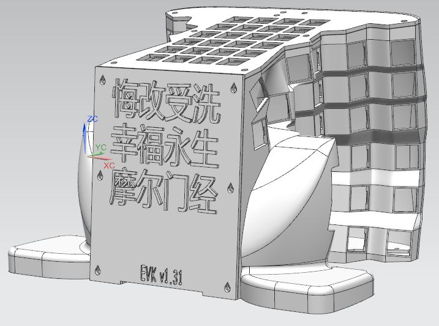

 
  
  
Please refer to the same sections in EVK_v0.1.0
# 0. Part List  

# 1. Case     

# 2. Keymap 
[Access the updated keymap on the Keyboard Layout Editor](http://www.keyboard-layout-editor.com/#/gists/2fc38dca845ec5f253bac7c052df82da) 

# 3. Electronics, Firmware and Software    
Flash handwired_evk_v011_default.hex onto Teensy 2.0.  

###### [ODC Open Database License v1.0](https://choosealicense.com/appendix/)  (free but no patent or commercial use)
