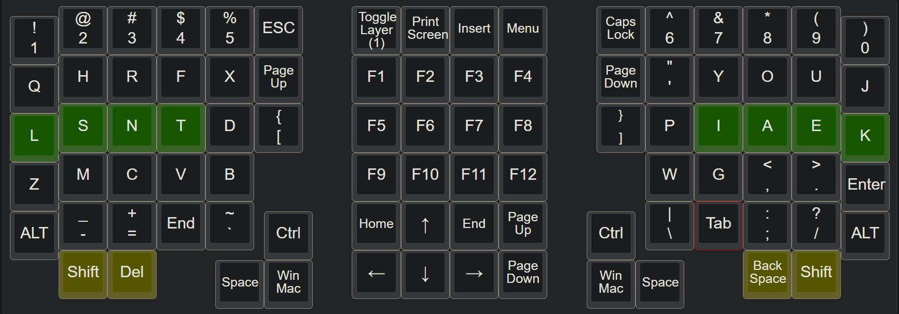

# Keymap 

## 0. Manual Optimization
I manually designed a keymap based on English [letter](https://norvig.com/mayzner.html) and [character](http://xahlee.info/comp/computer_language_char_distribution.html) frequencies.  
[Access this keymap on the Keyboard Layout Editor](http://www.keyboard-layout-editor.com/#/gists/22fd1367d74f0ee4a891c60fcb62eb59)  
  
[It fares OK against other traidtional layouts according to the Keyboard Layout Analyzer.](http://patorjk.com/keyboard-layout-analyzer/#/load/hqrGn4NG)  

## 1. Algorithmic Optimization (Under Development - can use some help)
The layout should accommodate world's languages according to their usage.

### 1. Preparation
[The Carpalx Layout - simulated annealing](http://mkweb.bcgsc.ca/carpalx/?simulated_annealing) | [white_keyboard_layout](https://github.com/mw8/white_keyboard_layout) | [ThinQu Layout](https://microexploitation.com/2018/06/04/thinqu/)  

Download sample word data. [World's Language Usage](https://www.vistawide.com/languages/top_30_languages.htm)
[English Letter Frequencies](https://norvig.com/mayzner.html)
[Chinese Letter Frequencies](http://xahlee.info/kbd/chinese_pinyin_letter_frequency.html)
Weight the frequencies with the ratio of total number of speakers of each language.
[Top 30 languages of the world](https://www.vistawide.com/languages/top_30_languages.htm)

Get symbol frequencies for 'spaces', 'enter', 'comma'... from literature and from codes in (C++, Python, etc.). 
[http://xahlee.info/comp/computer_language_char_distribution.html](http://xahlee.info/comp/computer_language_char_distribution.html)

### 2. Scoring Logic:
Each finger's usage should be proportional to its strength, the cube of its diameter.  
Diameter of my left index finder (LI): 56mm / LM: 54mm / LR: 53mm / LP: 47mm
So the ratio of finger key presses should be 1.69 : 1.52 : 1.43 : 1.

how comfortably one presses simple operations such as 'ctrl + c' needs to be taken into account.

If a hand changes row, the other hand types two charactors.  
Change two rows with two different finger better than change two rows with the same finger.

switch 1 or 2 rows needs the other hand to type two letters to be optimal. Switching 3 rows requires the other hand to strike 3 times.

make the right index and mid fingers type slightly less, as most people use these two fingers to click the mouse.

### 3. Implementation

class Key
{
private:
	
}

finger class

Next step:
1. ~~Break down the problem into smaller parts for C++.~~
2. Figure out how to do simulated annealling. 

###### [ODC Open Database License v1.0](https://choosealicense.com/appendix/)  (free but no patent or commercial use)